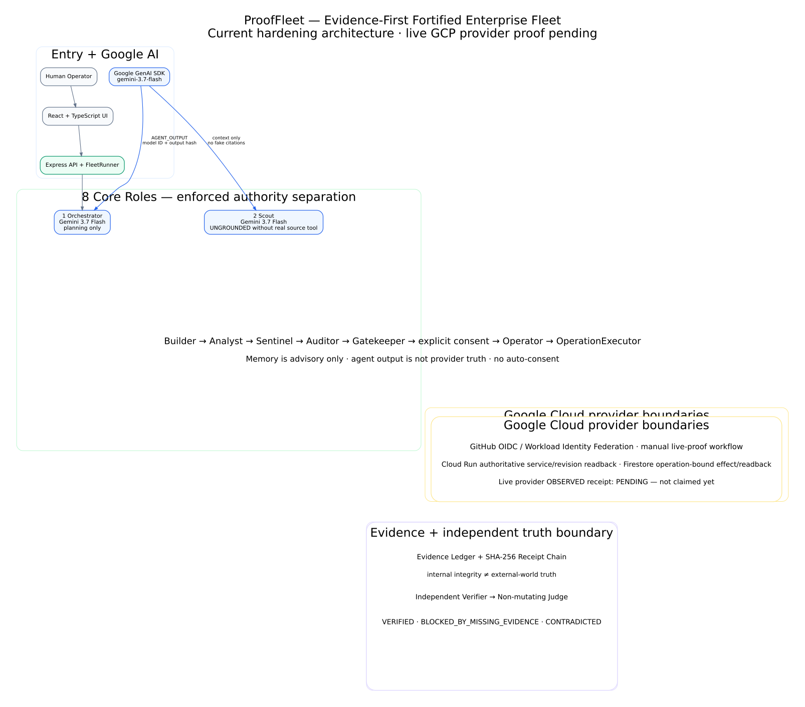

# ProofFleet — Autonomous Agents You Can Verify

ProofFleet is an evidence-first multi-agent system built for the **Google All Things Agentic Hackathon / Fortified Enterprise Fleet** track.

The core rule is deliberately strict: **an agent saying “done” is not proof that anything happened.** ProofFleet separates planning, execution, explicit human consent, authoritative provider readback, evidence sealing, independent verification, and final judgment so that missing evidence stays missing instead of being painted green.

> **ProofFleet doesn't ask you to trust autonomous agents. It gives you evidence to verify them.**

## Judge in 90 seconds

The fastest evidence-first review path is:

1. **Start with the exact application source:** `f432b111a621a4a57afe229b0f50fbb129aaa164`.
2. **Reproduce the software chain:** ProofFleet CI Run #273 passed TypeScript, **42 test files / 220 tests**, truth guards, production build, authenticated HTTP E2E, exact Docker runtime smoke, revision receipt, and high/critical dependency audit.
3. **Inspect the live Google Cloud proof:** Candidate Deploy Run #12 (`32516371741`) created Cloud Run revision `prooffleet-00008-lux` at **0% normal traffic** and independently read it back.
4. **Follow the supply-chain identity:** source SHA → immutable OCI image index → exact `linux/amd64` child manifest → Cloud Run revision readback.
5. **Check the truth boundary:** tagged `/api/health` is observed; ADK canary is eligible but still **`NOT_RUN`**; Firestore live effect is prepared but not claimed `OBSERVED`; Agent Search grounding remains **`NOT_CONFIGURED`**.

The live candidate receipt is `prooffleet.gcp-deploy-candidate.v2`, uploaded by Run #12 as GitHub Actions artifact `9458987801`.

For a criterion-by-criterion review, open [`docs/JURY.md`](docs/JURY.md). For a clean unedited demo plan, open [`docs/DEMO.md`](docs/DEMO.md).

## Current evidence status

| Claim | Status | Authority |
|---|---|---|
| Application regression chain | **CI-PROVEN** | CI #273, exact source + synthetic merge receipt |
| Cloud Run candidate deployment | **LIVE OBSERVED** | WIF deploy + independent Cloud Run readback |
| Candidate source/revision binding | **LIVE OBSERVED** | source SHA, labels, declared source env, exact revision |
| OCI index → runtime manifest | **LIVE OBSERVED** | registry raw bytes + SHA-256 + exact `linux/amd64` child |
| Tagged candidate HTTP health | **LIVE OBSERVED** | exact candidate URL `/api/health` |
| Candidate normal traffic | **0%** | Cloud Run service traffic readback |
| Production promotion | **NOT PERFORMED** | promotion workflow skipped |
| ADK canary eligibility | **OBSERVED** | candidate read-only canary endpoint |
| ADK/Gemini live canary | **`NOT_RUN`** | no stronger claim is made |
| Firestore live effect | **PREPARED / NOT OBSERVED** | manual, bounded workflow exists |
| Agent Search grounding | **`NOT_CONFIGURED`** | intentionally dormant; no paid call needed |

PR #1 remains Draft. `main` remains unchanged.

---

## Architecture at a glance



Source diagram: [`docs/architecture/prooffleet-architecture.mmd`](docs/architecture/prooffleet-architecture.mmd).

The runtime enforces these boundaries:

- **Actor != Verifier != Judge**
- eight concrete core roles have explicit authority boundaries
- Google ADK / Gemini reasoning is context or `AGENT_OUTPUT`, not external-world proof
- memory is advisory and cannot satisfy runtime-required evidence
- write/execute operations require an operation-bound consent grant
- ambiguous mutations use readback-before-retry
- unavailable readback means **no blind write**
- only authoritative runtime evidence can satisfy a runtime-required Judge proof requirement

### Eight core roles

1. **Orchestrator** — Google ADK / Gemini planning, no final verdict authority
2. **Scout** — Google ADK / Gemini context, explicitly ungrounded without a real source tool
3. **Builder** — deterministic artifact preparation
4. **Analyst** — deterministic analysis, no invented confidence score
5. **Sentinel** — security and permission checks
6. **Auditor** — integrity checks, cannot replace the Judge
7. **Gatekeeper** — concrete `OperationSpec` + explicit consent boundary
8. **Operator** — authorized effects only, cannot self-judge

---

# Reproduce the exact software chain

## Prerequisites

- Git
- Node.js **22.x**
- npm **10.x**

No Google Cloud credentials or Gemini key are required for the local verification chain. Provider-facing test contracts use test-only doubles; production runtime paths remain fail-closed when real configuration is absent.

## Exact live-proven application source

```bash
git clone https://github.com/OuroborosCollective/Prooffleet.git
cd Prooffleet
git checkout f432b111a621a4a57afe229b0f50fbb129aaa164
npm ci
npm run verify:ci
```

`verify:ci` performs:

1. TypeScript contract check (`tsc --noEmit`)
2. unit + adversarial regression suite
3. production truth guards
4. production Vite + esbuild build
5. real started production-server HTTP smoke on an injected runtime port
6. authenticated production mission / concurrency / reset / consent HTTP E2E

A passing local chain proves those software contracts in that environment. It does **not** substitute for provider-side Google Cloud evidence.

Useful narrower commands:

```bash
npm run lint
npm test
npm run build
```

---

# Run the application locally

Development:

```bash
npm run dev
```

Production build/runtime:

```bash
npm run build
NODE_ENV=production PORT=3000 npm start
curl -fsS http://127.0.0.1:3000/api/health
```

Cloud Run injects `PORT`; the server honors the managed-runtime value.

---

# Authority, consent, idempotency, and evidence

For a write/execute operation:

1. Gatekeeper derives a concrete `OperationSpec`.
2. Consent is bound to that exact operation hash.
3. A human explicitly approves or rejects.
4. Only an `APPROVED` execution grant can authorize the Operator.
5. `OperationExecutor` performs readback before mutation or retry.
6. Matching existing target state becomes `already_applied`.
7. Conflicting identity fails closed.
8. Unavailable readback does not authorize a write.
9. Only readback-observed durable success is cached as final.

The adversarial regression suite includes **50 parallel executions with one operation ID**, which must result in exactly one apply.

The final Judge vocabulary is intentionally small:

```text
VERIFIED
BLOCKED_BY_MISSING_EVIDENCE
CONTRADICTED
```

`VERIFIED` is never a synonym for “an agent returned success.” A static candidate, model output, memory entry, or hash-valid internal artifact cannot satisfy a runtime claim that requires an authoritative external readback.

SHA-256 is used to prove byte and identity relationships. It does **not** by itself prove external-world truth.

---

# Google agent and cloud stack

## Google ADK + Gemini

Canonical reasoning contract:

```text
framework: Google ADK
model:     gemini-3.7-flash
```

Only Orchestrator and Scout receive the reasoning provider. The ADK layer has no tool, mutation, consent, evidence-sealing, or Judge authority.

The deployed candidate's read-only canary endpoint reports:

```text
eligible: true
status:   NOT_RUN
```

That is intentionally **not** upgraded into a live-model claim.

## Live Cloud Run candidate proof

Exact source:

```text
f432b111a621a4a57afe229b0f50fbb129aaa164
```

Candidate Run #12 observed:

```text
project:         project-b29d4703-a302-4b05-b2e
region:          europe-west1
service:         prooffleet
revision:        prooffleet-00008-lux
candidate tag:   pf-f432b111a621
normal traffic:  0%
```

The v2 receipt proves both container identities rather than conflating them:

```text
OCI image index:
sha256:0ad47bce1a90bb62c927c0b89f085c4d83171bfb96f626f708f126a69bc30d6d

linux/amd64 runtime manifest:
sha256:e5d22049a6994087552004064c7a1acf96e440618b5562fdb346282f8b88dc81
```

Registry raw bytes are hashed back to the immutable index digest; exactly one supported `linux/amd64` child manifest is selected; independent Cloud Run revision readback must report that exact child manifest. Runtime service account and inherited environment-variable names are also checked for preservation before the receipt can proceed to HTTP smoke.

## Manual Firestore live-proof lane

Workflow:

```text
.github/workflows/gcp-live-proof.yml
```

It is deliberately `workflow_dispatch`-only and requires the exact confirmation phrase:

```text
I_APPROVE_PROOFFLEET_FIRESTORE_PROOF_WRITE
```

The lane first requires authoritative Cloud Run source readback, then constructs an operation-bound Firestore effect, explicit consent grant, idempotent executor, and authoritative Firestore readback. Only `applied` or `already_applied` with `FIRESTORE_READBACK` bound to the same source revision can produce an `OBSERVED` live-proof receipt.

**No Firestore `OBSERVED` receipt is claimed yet.**

## Other Google Cloud adapters

ProofFleet includes fail-closed adapters/runbooks for Firestore, Secret Manager, Pub/Sub, Cloud Run, Model Armor, Vertex AI Agent Engine/ADK, and OpenTelemetry. See [`server/adapters/gcp/README.md`](server/adapters/gcp/README.md).

An adapter reports `NOT_PROVISIONED` / failed readback when configuration, API, dependency, IAM, or real resource is missing. Prepared adapter code is not presented as a live managed-service claim.

## Agent Search grounding

The grounding lane is intentionally dormant:

```text
NOT_CONFIGURED
```

Grounding evidence cannot become a Judge verdict by itself, and no paid Agent Search request is required merely to make the submission look more complete.

---

# Environment configuration

Start from:

```bash
cp .env.example .env
```

Never commit `.env`, Workload Identity credential artifacts, operator credentials, or live-proof receipts.

Common runtime variables include:

```text
GEMINI_API_KEY
PROOFFLEET_OPERATOR_TOKEN
PROOFFLEET_SESSION_SECRET
PROOFFLEET_OPERATOR_IDENTITY
PROOFFLEET_HMAC_SECRET
GCP_PROJECT_ID
GCP_REGION
PROOFFLEET_CLOUDRUN_SERVICE
PROOFFLEET_FIRESTORE_COLLECTION
PROOFFLEET_SOURCE_REVISION
PROOFFLEET_PUBSUB_TOPIC
PROOFFLEET_SECRET_NAME
PROOFFLEET_MODEL_ARMOR_TEMPLATE
ADK_AGENT_ENGINE_ID
OTEL_ENABLED
OTEL_EXPORTER_OTLP_ENDPOINT
```

If evidence signing is not configured, ProofFleet leaves evidence honestly unsigned rather than fabricating authentication.

---

# CI revision identity

Pull-request Actions test a synthetic merge commit. ProofFleet records source and tested identities separately in `prooffleet.ci-revision-receipt.v1`:

```text
sourceHeadSha
baseSha
testedCheckoutSha
testedMergeSha
```

For CI #273:

```text
sourceHeadSha:      f432b111a621a4a57afe229b0f50fbb129aaa164
baseSha:            89302dfbe1ef732ff3962b47ce914a7e299f5075
testedMergeSha:     a0d12bfa40f10382d8f7c3ee9a6c4ce378c9c523
```

This avoids pretending a PR source SHA and GitHub's tested merge SHA are the same object.

---

# Hackathon review assets

- **Jury evidence matrix:** [`docs/JURY.md`](docs/JURY.md)
- **Unedited demo plan:** [`docs/DEMO.md`](docs/DEMO.md)
- **Architecture source:** [`docs/architecture/prooffleet-architecture.mmd`](docs/architecture/prooffleet-architecture.mmd)
- **Architecture render:** [`docs/architecture/prooffleet-architecture.svg`](docs/architecture/prooffleet-architecture.svg)
- **Live candidate evidence:** PR #1 + Candidate Deploy Run #12 / artifact `9458987801`

The public Devpost project is updated from the same evidence boundary. A final demo video must still be a real YouTube/Vimeo artifact; this repository does not claim one exists until it does.

---

## Origin / disclosure

The project was initially scaffolded through Google AI Studio and exported to this GitHub repository. The hackathon implementation has since been hardened on the dedicated feature branch. Evidence-first architectural ideas reflect prior operational learnings, while this ProofFleet implementation is its own hackathon project.

## License / use

See repository licensing and hackathon submission terms applicable to this project. Third-party Google Cloud and Gemini services remain subject to their own terms and credentials.
