# ProofFleet — Autonomous Agents You Can Verify

ProofFleet is an evidence-first multi-agent engineering prototype built for the **Google All Things Agentic Hackathon / Fortified Enterprise Fleet** track.

The central idea is simple: an agent saying that an action succeeded is **not** proof that the action happened. ProofFleet separates planning, execution, consent, verification and judgment, then requires authoritative readback before an external effect may count as verified truth.

> **ProofFleet doesn't ask you to trust autonomous agents. It gives you evidence to verify them.**

## Current status

The active hardening candidate lives on:

```text
hardening/fortified-fleet
```

PR #1 remains Draft. `main` is intentionally not treated as the final hackathon candidate yet.

The repository contains a fully automated local/CI verification chain and a **manual-only** Google Cloud live-proof lane. The live Google Cloud lane is designed to fail closed until real project, Workload Identity Federation, Cloud Run and Firestore identities are configured.

**No live Google Cloud success should be inferred merely from this README, unit tests, adapter code or a green local CI run.** Provider success requires a real Google Cloud API readback and a live-proof receipt.

---

## Architecture at a glance

```mermaid
flowchart LR
    U[Human Operator] --> UI[React / TypeScript UI]
    UI --> API[Express Runtime]

    API --> O[Orchestrator]
    O --> S[Scout]
    S --> B[Builder]
    B --> A[Analyst]
    A --> SE[Sentinel]
    SE --> G[Gatekeeper]
    G --> C{Explicit Consent}
    C -->|approved| OP[Operator]
    C -->|rejected| J[Judge]

    OP --> EX[OperationExecutor]
    EX -->|readback before write/retry| FS[(Firestore)]
    FS -->|authoritative readback| EV[Evidence + Receipts]

    API --> CR[Cloud Run Readback]
    CR --> EV
    EV --> V[Independent Verifier]
    V --> J[Non-mutating Judge]

    J --> R1[VERIFIED]
    J --> R2[BLOCKED_BY_MISSING_EVIDENCE]
    J --> R3[CONTRADICTED]
```



Important boundaries:

- **Actor != Verifier != Judge**
- memory/context is advisory and cannot satisfy runtime proof
- SHA-256 proves byte/integrity relationships, not external-world truth
- write/execute operations require an operation-bound consent grant
- ambiguous mutations require authoritative readback before retry
- a missing provider readback means **no blind write**

---

# Reproducible local verification

These are the canonical testing instructions used by GitHub Actions.

## Prerequisites

- Git
- Node.js **22.x**
- npm **10.x**

No Google Cloud credentials or Gemini key are required for the local verification chain. Tests that touch provider contracts use test-only doubles; the production runtime remains fail-closed when real provider configuration is absent.

## 1. Clone and select the candidate

```bash
git clone https://github.com/OuroborosCollective/Prooffleet.git
cd Prooffleet
git checkout hardening/fortified-fleet
```

For an auditable reproduction, replace the branch checkout with the exact source SHA shown by the latest ProofFleet CI revision receipt.

## 2. Install the immutable dependency graph

```bash
npm ci
```

`package-lock.json` is committed and is the installation contract. Do not replace `npm ci` with an unconstrained dependency refresh when reproducing a recorded CI result.

## 3. Run the canonical verification chain

```bash
npm run verify:ci
```

`verify:ci` performs, in order:

1. TypeScript contract check (`tsc --noEmit`)
2. unit + adversarial regression suite (Vitest)
3. production truth guards
4. production Vite + esbuild build
5. a real started production-server HTTP smoke on an injected runtime port
6. authenticated production consent HTTP E2E

A passing local chain proves those exact contracts under that local environment. It **does not** prove a Google Cloud service is provisioned or that an external cloud mutation occurred.

Useful narrower commands:

```bash
npm run lint
npm test
npm run build
```

---

# Run the application locally

## Development mode

```bash
npm run dev
```

Default local URL:

```text
http://localhost:3000
```

## Production build + production server

```bash
npm run build
NODE_ENV=production PORT=3000 npm start
```

Health check:

```bash
curl -fsS http://127.0.0.1:3000/api/health
```

Cloud Run injects `PORT`; the server honors that value instead of assuming port 3000.

---

# Environment configuration

Start from the documented template:

```bash
cp .env.example .env
```

Never commit `.env`, Workload Identity credential artifacts or live-proof receipts.

## Gemini

```text
GEMINI_API_KEY
```

The codebase uses Google's GenAI SDK (`@google/genai`). The exact model used for the final hackathon submission must be validated against the live Google API/deployment and recorded truthfully in the final Devpost entry.

## Operator authentication

```text
PROOFFLEET_OPERATOR_TOKEN
PROOFFLEET_SESSION_SECRET
PROOFFLEET_OPERATOR_IDENTITY
```

Both token and session secret are required before consent decisions can be made in the production HTTP path. Operator identity is derived server-side from the authenticated session; a client request cannot assert its own operator identity.

## Evidence signing

```text
PROOFFLEET_HMAC_SECRET
```

If no HMAC secret is configured, ProofFleet does not fabricate a signature. Evidence remains honestly unsigned rather than pretending authentication occurred.

## Google Cloud adapter configuration

```text
GCP_PROJECT_ID
GCP_REGION
PROOFFLEET_CLOUDRUN_SERVICE
PROOFFLEET_FIRESTORE_COLLECTION
PROOFFLEET_SOURCE_REVISION
PROOFFLEET_PUBSUB_TOPIC
PROOFFLEET_SECRET_NAME
PROOFFLEET_MODEL_ARMOR_TEMPLATE
ADK_AGENT_ENGINE_ID
OTEL_ENABLED
OTEL_EXPORTER_OTLP_ENDPOINT
```

Detailed provider/IAM notes are in:

```text
server/adapters/gcp/README.md
```

Without real configuration + credentials, adapters report `NOT_PROVISIONED`/failed readback honestly.

---

# Evidence and verdict semantics

The final Judge vocabulary is deliberately small:

```text
VERIFIED
BLOCKED_BY_MISSING_EVIDENCE
CONTRADICTED
```

`VERIFIED` is not a synonym for "an agent returned success".

For runtime claims, ProofFleet can require evidence bound to:

- operation ID
- mission/revision
- source revision
- deployment revision where applicable
- allowed authoritative source kind
- recomputing evidence/receipt hashes

Examples of authoritative runtime source kinds include Cloud Run and Firestore readback. A static candidate, agent output or memory entry cannot satisfy a runtime-required proof requirement.

---

# Consent and idempotency contracts

For write/execute operations:

1. Gatekeeper derives a concrete `OperationSpec`.
2. Consent is bound to that exact operation hash.
3. A human explicitly approves or rejects.
4. Only an APPROVED execution grant can authorize the Operator.
5. OperationExecutor performs readback before mutation/retry.
6. Existing matching target state becomes `already_applied`.
7. Existing conflicting identity fails closed.
8. An unavailable readback does not authorize a write.
9. Only readback-observed durable success is cached as final.

The regression suite includes an adversarial concurrency case where **50 parallel calls with the same operation ID must result in exactly one apply**.

---

# Manual Google Cloud live-proof workflow

Workflow:

```text
.github/workflows/gcp-live-proof.yml
```

It is intentionally `workflow_dispatch`-only. It does **not** run on push or pull requests.

Authentication uses Google Workload Identity Federation through GitHub OIDC. The workflow does not accept a long-lived service-account JSON key.

Required GitHub repository variables:

```text
PROOFFLEET_GCP_PROJECT_ID
PROOFFLEET_GCP_REGION
PROOFFLEET_GCP_WIF_PROVIDER
PROOFFLEET_GCP_WIF_SERVICE_ACCOUNT
PROOFFLEET_CLOUDRUN_SERVICE
PROOFFLEET_FIRESTORE_COLLECTION
```

The WIF provider must be the complete provider resource name, for example:

```text
projects/<PROJECT_NUMBER>/locations/global/workloadIdentityPools/<POOL>/providers/<PROVIDER>
```

## Mutation confirmation

The live workflow will not authorize the operation-bound Firestore proof write unless the manual dispatch contains the exact phrase:

```text
I_APPROVE_PROOFFLEET_FIRESTORE_PROOF_WRITE
```

Even with that phrase, the workflow first performs an authoritative Cloud Run readback and requires the service's declared:

```text
PROOFFLEET_SOURCE_REVISION
```

to match the exact GitHub workflow source SHA. An old or unrelated deployment therefore cannot be silently used as proof for the current source candidate.

The live runner writes:

```text
gcp-live-proof-receipt.json
```

as a GitHub Actions artifact. Possible live receipt outcomes are:

```text
OBSERVED
BLOCKED_BY_MISSING_EVIDENCE
CONTRADICTED
```

`OBSERVED` means the configured provider boundaries were actually observed; it is intentionally not a shortcut around the application's independent Judge.

---

# CI revision receipts

Pull-request GitHub Actions execute a synthetic merge commit. ProofFleet records this explicitly instead of conflating it with the source branch head.

Receipt schema:

```text
prooffleet.ci-revision-receipt.v1
```

Fields include:

```text
sourceHeadSha
baseSha
testedCheckoutSha
testedMergeSha
```

When reproducing a CI result, use the exact source head and note that PR compatibility was tested through the recorded synthetic merge SHA.

---

# Security / secret hygiene

Generated authentication and evidence artifacts are excluded from both Git and Docker build contexts:

```text
gha-creds-*.json
gcp-live-proof-receipt.json
.env*
```

Production runtime code is guarded against importing mocks/fakes/test doubles. Test doubles belong under the test boundary only.

---

# Hackathon reproducibility notes

For judges/testers, the shortest deterministic verification path is:

```bash
git clone https://github.com/OuroborosCollective/Prooffleet.git
cd Prooffleet
git checkout <EXACT_SUBMITTED_SOURCE_SHA>
npm ci
npm run verify:ci
```

Then, if Google Cloud live-proof access is intentionally provided, compare the submitted source SHA with:

1. the Cloud Run service's declared `PROOFFLEET_SOURCE_REVISION`;
2. the live Cloud Run readback receipt;
3. the operation-bound Firestore document/readback;
4. the corresponding ProofFleet evidence/receipt chain and Judge verdict.

This repository deliberately distinguishes **reproducible software tests** from **provider-side deployment proof**.

---

## Origin / disclosure

The project was initially scaffolded through Google AI Studio and exported to this GitHub repository. The hackathon implementation has since been hardened on the dedicated feature branch. Evidence-first architectural ideas reflect prior operational learnings, while this ProofFleet implementation is built as its own hackathon project.

## License / use

See repository licensing and hackathon submission terms applicable to this project. Third-party Google Cloud and Gemini services remain subject to their own terms and credentials.
